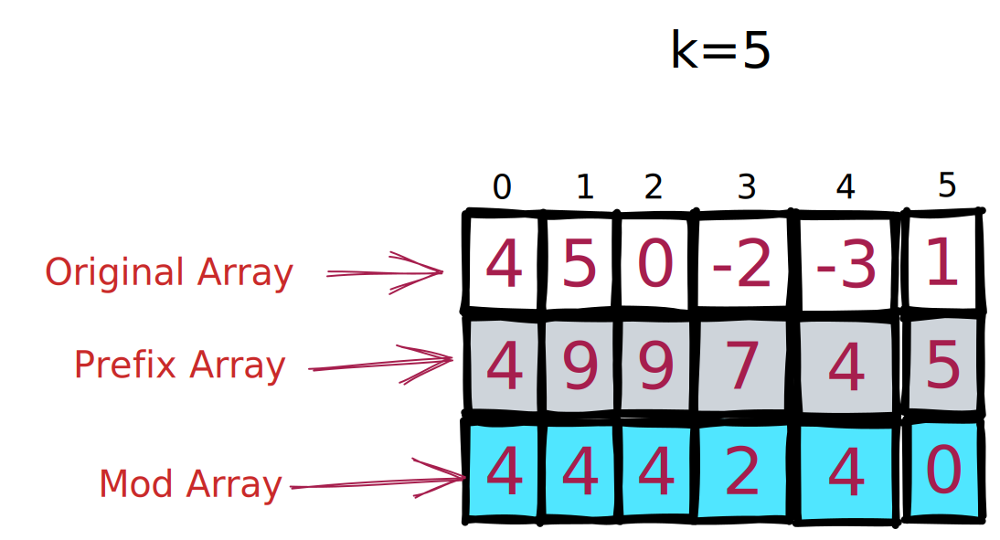

# Sub Array Sum Divisible by K

### Problem

[https://leetcode.com/problems/subarray-sums-divisible-by-k/](https://leetcode.com/problems/subarray-sums-divisible-by-k/)

<figure><figcaption></figcaption></figure>

### Understanding of problem



```
  Input:  A = [4,5,0,-2,-3,1], K = 5
            Map  
  step 1 : {0:1}          a=4    sum=4  mod=4  count = 0+0 =0
  step 2 : {0:1,4:1}      a=5    sum=9  mod=4  count = 0+1 =1
  step 3 : {0:1,4:2}      a=0    sum=9  mod=4  count = 1+2 =3
  step 4 : {0:1,4:3}      a=-2   sum=7  mod=2  count = 3+0 =3  
  step 6 : {0:1,4:3,2:1}  a=-3   sum=4  mod=4  count = 3+3 =6
  step 7 : {0:1,4:4,2:1}  a=1    sum=5  mod=0  count = 6+1 =7

```

In the above example, we can see 4 is occurring multiple times. Let's check if the subarray sum where prefix mod equals 4 will be divisible by zero or not.



* The algorithm counts if the given subarray is divisible by "k" first
* Then proceeds to update the frequency of the mod in the frequency map next


We initialise the sum to zero, so mod of zero is zero, So we add the frequency of 1 to the map

At index 0,

```
ModFrequencyMap: {0:1, 4:1}
Count: 0
```

If we see the subarray sum at index 1, the mod value is 4 again. So we increment the count by number of time we have seen mod value as 4 so far. So far frequency of mod value 4 is "1", so count is "1"

We take sub-array of `modArray[0, i]` where `i` is 1, the mod value is 4. Then if take the sub array

```
prefix[0,1] = prefix[0,1] - prefix[0,0]
            =  9 - 4 = 5 
```

The subarray sum of `prefix[0,1]` is 5, so it is divisible by 5, so the count is 1

If we keep moving forward to index 2

```
prefix[1,2] = prefix[0,2] - prefix[0,0]
            =  9 - 4 = 5 
```

The subarray sum of `prefix[0,2]` is 5, so it is divisible by 5, so the count is 1


### Solution

```java
class Solution {
    public int subarraysDivByK(int[] nums, int k) {
        // Time Complexity: O(n), n-> number of elements in nums
        // Space Complexity: O(n), For storing prefix sums of "n" elements

        // Edge case
        if(nums==null) {
            return 0;
        }

        // Creating a mod frequency map
        // Since we wanted to find the subarray sums divisible by "k", we need to keep track of 
        // "mods" and its frequency
        int[] modFrequencyMap = new int[k];
        
        // Keep track of running sum and keep track of count
        int prefix = 0, count = 0;
        
        // This is an edge case, when prefix = 0, then the mod of the prefix = 0
        // So we add the frequency of +1 to it
        modFrequencyMap[0] = 1;

        for(int i=0;i<nums.length;i++) { // Iterate through array
            prefix += nums[i]; // Calculate prefix running sum
            int mod = prefix % k; // This is the complement version, here we are interested in finding mods 
            // If mod is less than zero, we cannot put the frequency in our map, so using modular
            // arithmetic, it is converted to positive number(which represents index in frequency map)
            // by adding "k" to the existing mode
            if(mod < 0) { 
                mod += k;
            }

            // If we encounter a mod value that has already occurred before, then we can 
            // form a subarray with sum divisible by k using the prefix sum values between 
            // the two occurrences of that mod value.
            count += modFrequencyMap[mod];
            // Update the frequency of current mod
            modFrequencyMap[mod]++;
        }
        return count;
    }
}
```
