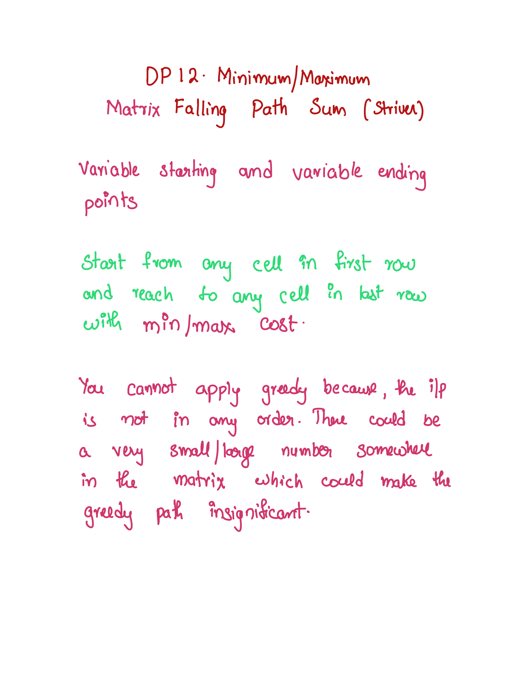

# 120. Triangle

## Problem



## Intuition

<div align="left">

<figure><figcaption></figcaption></figure>

 

<figure><figcaption></figcaption></figure>

</div>

<div>

<figure><figcaption></figcaption></figure>

 

<figure><figcaption></figcaption></figure>

</div>

## Time and SpaceComplexity

|                                    | Time Complexity | Space Complexity                                                          |
| ---------------------------------- | --------------- | ------------------------------------------------------------------------- |
| Tabulation with Space Optimization | $$O(n^2)$$      | O(n)                                                                      |
| Tabulation                         | $$O(n^2)$$      | $$O(n^2)$$                                                                |
| Memoization                        | $$O(n^2)$$      | <p><span class="math">O(n^2) + O(h)</span></p><p>h -> recursion stack</p> |
| Recursion                          | $$O(2^n)$$      | $$O(n) + O(h)$$                                                           |


## Solution

```java
class Solution {
    public int minimumTotal(List<List<Integer>> triangle) {

        // return recursionHelper(0, 0, triangle);
        // int n = triangle.size();
        // int[][] dp = new int[n][n];
        // for(int[] row: dp) {
        //     Arrays.fill(row, -1);
        // }

        // return memoizationHelper(0, 0, triangle, dp);

        // return tabulationHelper(triangle);
        return tabulationSpaceOptimisedHelper(triangle);
    }

    /**
     * Tabulation (Space Optimized) Approach:
     * Start from the bottom of the triangle and keep calculating the minimum path sum for each row.
     * Update the values in a rolling fashion, reusing the same space for storage.
     * Finally, the value at the top of the triangle represents the minimum path sum.
     *
     * Time Complexity: O(n^2), where n is the number of rows in the triangle.
     * Space Complexity: O(n), as we are using a single array to store intermediate values.
     */
    private int tabulationSpaceOptimisedHelper(List<List<Integer>> triangle) {
        int n = triangle.size();
        List<Integer> belowRow = triangle.get(n-1);

        for(int row = n-2;row >= 0;row--) {
            LinkedList<Integer> currentRow = new LinkedList<>();
            for(int col = row;col >= 0;col--) {
                int currentVal = triangle.get(row).get(col);
                int down = currentVal + belowRow.get(col);
                int diag = currentVal + belowRow.get(col+1);
                
                currentRow.addFirst(Math.min(down, diag));
            }
            belowRow = new ArrayList<>(currentRow);
        }

        return belowRow.get(0);
    }

    /**
     * Tabulation Approach:
     * Create a DP table to store the minimum path sum for each position in the triangle.
     * Start from the bottom row and fill the table by choosing the minimum path from the next row.
     * The minimum path sum at the top position represents the overall minimum path sum.
     *
     * Time Complexity: O(n^2), where n is the number of rows in the triangle.
     * Space Complexity: O(n^2), as we are using a 2D array to store intermediate values.
     */
    private int tabulationHelper(List<List<Integer>> triangle) {
        int n = triangle.size();
        int[][] dp = new int[n][n];

        for(int col=0;col<n;col++) {
            dp[n-1][col] = triangle.get(n-1).get(col);
        }

        for(int row=n-2;row>=0;row--) {
            for(int col=row;col>=0;col--) {
                int currentVal = triangle.get(row).get(col);
                int down = currentVal + dp[row+1][col];
                int diag = currentVal + dp[row+1][col+1];

                dp[row][col] = Math.min(down, diag);
            }
        }

        return dp[0][0];
    }

    /**
     * Memoization Approach:
     * Use a DP table to store the minimum path sum for each position in the triangle.
     * Recursively calculate the minimum path sum by choosing the minimum path from the next row.
     * Memoize the calculated values to avoid redundant computations.
     *
     * Time Complexity: O(n^2), where n is the number of rows in the triangle.
        It is actually less than that, but for sake of simplicity we call it O(n^2)
     * Space Complexity: O(n^2), as we are using a 2D array to store intermediate values.
     */
    private int memoizationHelper(int row, int col, List<List<Integer>> triangle, int[][] dp) {
        if(row == triangle.size()-1) {
            return triangle.get(row).get(col);
        }
        if(dp[row][col] != -1) {
            return dp[row][col];
        }

        int currentVal = triangle.get(row).get(col);
        int down = currentVal + recursionHelper(row+1, col, triangle);
        int diag = currentVal + recursionHelper(row+1, col+1, triangle);

        return dp[row][col] = Math.min(down, diag);
    }

    /**
     * Recursive Approach:
     * Recursively calculate the minimum path sum by choosing the minimum path from the next row.
     * Base case: If the current row is the last row, return the value at the current position.
     *
     * Time Complexity: O(2^n) Exponential, as there are overlapping subproblems.
     * Space Complexity: O(n), as the recursive calls occupy space on the call stack.
     */
    private int recursionHelper(int row, int col, List<List<Integer>> triangle) {
        if(row == triangle.size()-1) {
            return triangle.get(row).get(col);
        }

        int currentVal = triangle.get(row).get(col);
        int down = currentVal + recursionHelper(row+1, col, triangle);
        int diag = currentVal + recursionHelper(row+1, col+1, triangle);

        return Math.min(down, diag);
    }
}
```
