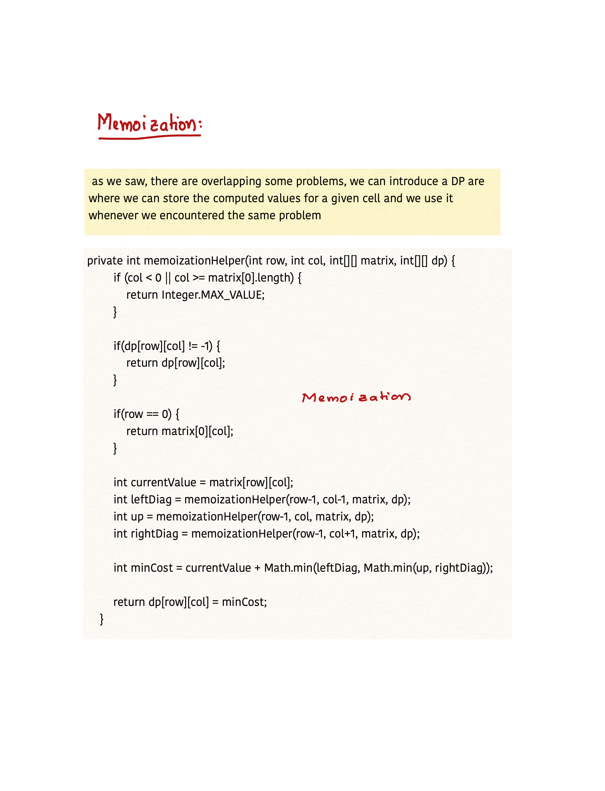

# 931. Minimum Falling Path Sum

## Problem



## Intuition

.png>).png>)



.png>)

## Time and SpaceComplexity

| Approach                           | Time Complexity | Space Complexity |
| ---------------------------------- | --------------- | ---------------- |
| Tabulation with space optimization | $$O(M*N)$$      | $$O(N)$$         |
| Tabulation                         | $$O(M*N)$$      | $$O(M*N)$$       |
| Memoization                        | $$O(M*N)$$      | $$O(M*N)$$       |
| Recursion                          | $$O(N*3^N)$$    | $$O(N)$$         |


## Solution

```java
class Solution {
    public int minFallingPathSum(int[][] matrix) {
        int R = matrix.length, C = matrix[0].length;
        int result = Integer.MAX_VALUE;
        // for(int i = 0; i < C; i++) {
        //     result = Math.min(result, recursionHelper(R-1, i, matrix));
        // }
        // int[][] dp = new int[R][C];
        
        // for(int[] row: dp) {
        //     Arrays.fill(row, -1);
        // }

        // for(int i = 0; i < C; i++) {
        //     result = Math.min(result, memoizationHelper(R-1, i, matrix,dp));
        // }
        // return result;

        // return tabulationHelper(matrix);
        return tabulationSpaceOptimisedHelper(matrix);
    }

        /**
    * Calculates the minimum falling path sum using tabulation with space optimization.
    *
    * @param matrix The input matrix.
    * @return The minimum falling path sum.
    */
    private int tabulationSpaceOptimisedHelper(int[][] matrix) {
        // N -> Number of rows, M -> Number of cols
        // Time Complexity: O(M*N), every cell is visited once
        // Space Complexity: O(N), Only one extra row space is required

        int R = matrix.length; // Number of rows
        int C = matrix[0].length; // Number of columns
        int[] prev = matrix[0]; // Store the previous row's path sums

        // Iterate through the remaining rows
        for (int row = 1; row < R; row++) {
            int[] current = matrix[row]; // Store the current row's path sums

            for (int col = 0; col < C; col++) {
                int leftDiag = Integer.MAX_VALUE;
                int up = Integer.MAX_VALUE;
                int rightDiag = Integer.MAX_VALUE;

                // Check if the left diagonal is within bounds
                if (col > 0) {
                    leftDiag = prev[col - 1];
                }

                up = prev[col]; // Value above in the previous row

                // Check if the right diagonal is within bounds
                if (col < C - 1) {
                    rightDiag = prev[col + 1];
                }

                int currentValue = matrix[row][col];

                // Calculate the minimum path sum by choosing the minimum among the three paths
                current[col] = currentValue + Math.min(leftDiag, Math.min(up, rightDiag));
            }

            prev = current; // Update the previous row's path sums with the current row's path sums
        }

        int result = Integer.MAX_VALUE;
        // Find the minimum path sum in the last row
        for (int val : prev) {
            result = Math.min(result, val);
        }

        return result;
    }


    /**
     * Calculates the minimum falling path sum using tabulation.
     *
     * @param matrix The input matrix.
     * @return The minimum falling path sum.
    */
    private int tabulationHelper(int[][] matrix) {
        // N -> Number of rows, M -> Number of cols
        // Time Complexity: O(M*N), every cell is visited once
        // Space Complexity: O(M*N)
            // O(M*N) -> DP array

        int R = matrix.length; // Number of rows
        int C = matrix[0].length; // Number of columns

        int[][] dp = new int[R][C]; // Create a 2D array to store the minimum path sums
        dp[0] = matrix[0]; // Initialize the first row with the same values as the input matrix

        // Iterate through the remaining rows
        for (int row = 1; row < R; row++) {
            for (int col = 0; col < C; col++) {
                int leftDiag = Integer.MAX_VALUE;
                int up = Integer.MAX_VALUE;
                int rightDiag = Integer.MAX_VALUE;

                // Check if the left diagonal is within bounds
                if (col > 0) {
                    leftDiag = dp[row - 1][col - 1];
                }

                up = dp[row - 1][col]; // Value above in the previous row

                // Check if the right diagonal is within bounds
                if (col < C - 1) {
                    rightDiag = dp[row - 1][col + 1];
                }

                int currentValue = matrix[row][col];

                // Calculate the minimum path sum by choosing the minimum among the three paths
                dp[row][col] = currentValue + Math.min(leftDiag, Math.min(up, rightDiag));
            }
        }

        int result = Integer.MAX_VALUE;
        // Find the minimum path sum in the last row
        for (int val : dp[R - 1]) {
            result = Math.min(result, val);
        }

        return result;
    }


    /**
     * Calculates the minimum falling path sum using memoization.
     *
     * @param row    The current row in the matrix.
     * @param col    The current column in the matrix.
     * @param matrix The input matrix.
     * @param dp     The memoization array to store computed values.
     * @return The minimum falling path sum starting from the current position.
    */
    private int memoizationHelper(int row, int col, int[][] matrix, int[][] dp) {
        // N -> Number of rows, M -> Number of cols
        // Time Complexity: O(M*N), every cell is visited once
        // Space Complexity: O(N) + O(M*N)
            // O(N) -> Recursion stack
            // O(M*N) -> DP array

        // Check if the current column is out of bounds
        if (col < 0 || col >= matrix[0].length) {
            return Integer.MAX_VALUE;
        }

        // Check if the value is already computed and stored in the memoization array
        if (dp[row][col] != -1) {
            return dp[row][col];
        }

        // Check if we have reached the top row
        if (row == 0) {
            return matrix[0][col];
        }

        int currentValue = matrix[row][col];

        // Calculate the minimum falling path sum by recursively exploring three possible paths
        int leftDiag = memoizationHelper(row - 1, col - 1, matrix, dp);
        int up = memoizationHelper(row - 1, col, matrix, dp);
        int rightDiag = memoizationHelper(row - 1, col + 1, matrix, dp);

        // Choose the minimum path sum among the three paths and add the current value
        int minCost = currentValue + Math.min(leftDiag, Math.min(up, rightDiag));

        return dp[row][col] = minCost;
    }


    // Recursive helper function to find the minimum falling path sum
    private int recursionHelper(int row, int col, int[][] matrix) {
        // N -> Number of rows
        // Time Complexity: O(N*3^N)
            // N -> Recursion Depth
            // 3^N -> 3 possibilites for every cell and for N cells it is 3^N
        // Space Complexity: O(N), recursion stack depth

        // Check if the column is out of bounds
        if(col < 0 || col >= matrix[0].length) {
            return Integer.MAX_VALUE;
        }

        // Base case: reached the top row
        if(row == 0) {
            return matrix[0][col];
        }

        // Calculate the minimum falling path sum by considering three possible paths
        int currentValue = matrix[row][col];
        int leftDiag = recursionHelper(row - 1, col - 1, matrix);
        int up = recursionHelper(row - 1, col, matrix);
        int rightDiag = recursionHelper(row - 1, col + 1, matrix);

        // Choose the minimum path sum and add the current value
        int minCost = Math.min(leftDiag, Math.min(up, rightDiag));
        minCost += currentValue;

        return minCost;
    }
}
```
