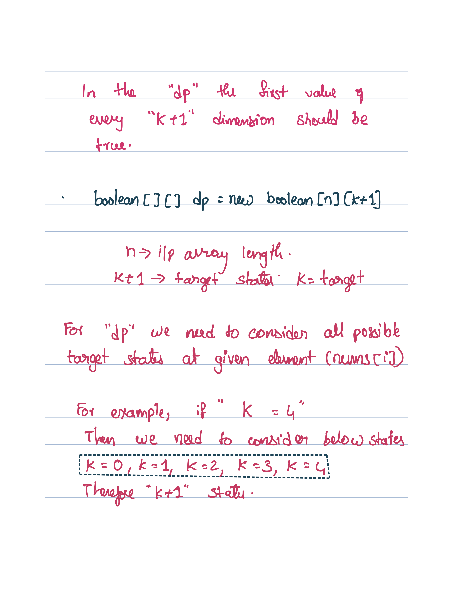

# Subset Sum Equal To K

## Problem



## Intuition



.png>)

.png>)


## Time  and Space Complexity

| Approach                   | Time Complexity | Space Complexity | Explaination                                             |
| -------------------------- | --------------- | ---------------- | -------------------------------------------------------- |
| Memoization                | `O(N^K)`        | `O(N^K) + O(N)`  | `N^k` is the number of states. O(N) -> Recursion Stack   |
| Tabulation                 | `O(N^K)`        | `O(N^K)`         | We store only the states computation. No recursion stack |
| Space Optimized Tabulation | `O(N^K)`        | O(K+1)           | Only the target possible states array is required        |


## Solution

```java
import java.util.*;
import java.io.*;


public class Solution {

  public static boolean subsetSumToK(int n, int k, int arr[]) {
    // This function checks if there exists a subset of elements from arr that sums up to k.
    // It uses a dynamic programming approach to solve the problem.

    // Uncomment one of the following approaches to solve the problem:

    // Approach 1: Recursive approach (commented out)
    // return recursiveHelper(n - 1, k, arr);

    // Approach 2: Memoization approach (commented out)
    // Integer[][] dp = new Integer[n][k + 1];
    // return memoizationHelper(n - 1, k, arr, dp);

    // Approach 3: Tabulation approach
    return tabulationHelper(n, k, arr);
  }

  private static boolean tabulationHelper(int n, int k, int[] arr) {
    // Tabulation approach using a 2D boolean array to store intermediate results.
    // dp[i][j] represents whether there exists a subset of elements from arr[0...i] that sums up to j.
    boolean[][] dp = new boolean[n][k + 1];

    // Base case: For target sum 0, there always exists an empty subset.
    for (int i = 0; i < n; i++) {
      dp[i][0] = true;
    }

    // Base case: If the first element of arr is less than or equal to k, it is a valid subset.
    if (arr[0] <= k) {
      dp[0][arr[0]] = true;
    }

    // Fill the dp table bottom-up
    for (int idx = 1; idx < n; idx++) {
      for (int target = 1; target <= k; target++) {
        boolean notPick = dp[idx - 1][target];
        boolean pick = false;

        // Check if the current element arr[idx] can be picked
        if (arr[idx] <= target) {
          pick = dp[idx - 1][target - arr[idx]];
        }

        // Either pick or not pick the current element
        dp[idx][target] = pick || notPick;
      }
    }

    // The result is stored at the last cell of the dp table
    return dp[n - 1][k];
  }

  private static boolean tabulationSpaceOptimizationHelper(int n, int k, int[] arr) {
    // Tabulation approach with space optimization using two boolean arrays.
    boolean[] prev = new boolean[k + 1]; // Array to store the previous row of the dp table.
    prev[0] = true; // Base case: An empty subset can form a sum of 0.
    if (arr[0] <= k) {
      prev[arr[0]] = true; // Base case: If the first element of arr is less than or equal to k, it is a valid subset.
    }

    for (int idx = 1; idx < n; idx++) {
      boolean[] curr = new boolean[k + 1]; // Array to store the current row of the dp table.
      curr[0] = true; // Base case: An empty subset can form a sum of 0.
      for (int target = 1; target <= k; target++) {
        boolean notPick = prev[target];
        boolean pick = false;

        // Check if the current element arr[idx] can be picked
        if (arr[idx] <= target) {
          pick = prev[target - arr[idx]];
        }

        // Either pick or not pick the current element
        curr[target] = pick || notPick;
      }

      prev = curr; // Update the previous row with the current row for the next iteration.
    }

    return prev[k]; // The result is stored at the last index of the prev array.
  }

  private static boolean memoizationHelper(int idx, int target, int[] arr, Integer[][] dp) {
    // Memoization approach using a 2D Integer array to store intermediate results.
    // dp[i][j] stores the result for the subproblem with arr[0...i] and target sum j.
    if (target == 0) {
      return true; // Base case: An empty subset can form a sum of 0.
    }

    if (idx == 0) {
      return arr[0] == target; // Base case: Only the first element is available.
    }

    if (dp[idx][target] != null) {
      return dp[idx][target] == 1; // Return the memoized result if available.
    }

    boolean notPick = recursiveHelper(idx - 1, target, arr);
    boolean pick = false;

    // Check if the current element arr[idx] can be picked
    if (arr[idx] <= target) {
      pick = recursiveHelper(idx - 1, target - arr[idx], arr);
    }

    // Store the result in the dp table and return it
    dp[idx][target] = pick || notPick ? 1 : 0;
    return pick || notPick;
  }

  private static boolean recursiveHelper(int idx, int target, int[] arr) {
    // Recursive approach to check if there exists a subset of elements from arr that sums up to the target.
    if (target == 0) {
      return true; // Base case: An empty subset can form a sum of 0.
    }

    if (idx == 0) {
      return arr[0] == target; // Base case: Only the first element is available.
    }

    boolean notPick = recursiveHelper(idx - 1, target, arr);
    boolean pick = false;

    // Check if the current element arr[idx] can be picked
    if (arr[idx] <= target) {
      pick = recursiveHelper(idx - 1, target - arr[idx], arr);
    }

    // Either pick or not pick the current element
    return pick || notPick;
  }
}
```
