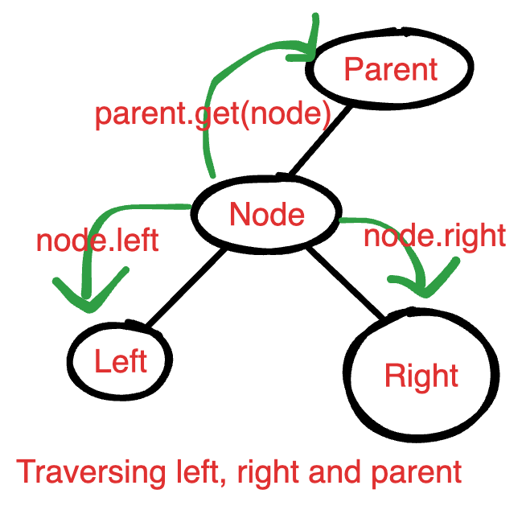

# Combinatorics



## Basic Counting

If there are `m` outcomes for event `A` and `n` outcomes for event `B`, then the total number of outcomes for both event `A` and `B` are:

$$
totalNumberOfOutcomes = m * n
$$

And if there are more events like `o` outcomes for event `C` then we simply need to multiply to get the total number of outcomes

$$
totalNumberOfOutcomes = m * n * 0
$$

***

## Permutations

A way in which a set of things can be ordered


<figure><figcaption></figcaption></figure>

<figure><figcaption></figcaption></figure>

<figure><figcaption></figcaption></figure>

When there are duplicate elements and we are tasked to find the different permutations, then the total number of elements factorial is taken and is divided by all the possible factorials of each unique element.

<figure><figcaption></figcaption></figure>

***


The major difference between permutation and combination is \
1\. Permutation is arrangement (**ORDER matters**)\
2\. Combination is selection (**ORDER DOES NOT MATTER**)


***

## Combinations

The number of groups of `r` objects that can be formed from total of `n` objects


Ordering does not matter. Even if the group has different order but the same objects, it is still considered to be same


Its formula is represented by&#x20;

$$
C(n, k) = \binom{n}{k} = \frac{n!}{k!(n-k)!}
$$

* $$n$$ is the total number of items in the set.
* $$k$$ is the number of items to be selected.

When you are explaining this in a Google interview, break the formula down into its two logical parts:

1. $$\frac{n!}{(n-k)!}$$: This is the formula for Permutations. It calculates all possible ordered arrangements.
2. $$\frac{1}{k!}$$: This is the "**Deduplication**" factor. Since the order doesn't matter in combinations, you divide by $$k!$$ to remove all the different orderings of the same group of items.

***

## Partitions

Dividing a set of elements into subsets

Dividing elements into groups

There are two different types of partitions

### Dividing Distinct elements into groups

This type of problem involves determining how many ways you can group a set of distinct elements into distinct groups of specified sizes.

**Example (Fish Problem):** Imagine there are eight different fish, and three people (Jiggle Bob, Max, and Reagan) want to eat a specific number of fish: Jiggle Bob wants four fish, Max wants two, and Reagan wants two (19:47-19:58). The question is how many ways these eight different fish can be grouped into distinct groups of four, two, and two (19:58-20:06).

### Stars and Bars method

This technique can be used in distributed problems.

#### 1. The Core Concept

Use this when distributing $$n$$ identical items into $$k$$ distinct bins.

* **Stars (**$$\star$$**):** The items you are distributing.
* **Bars (**$$|$$**):** The dividers that create the bins. <mark style="background-color:$primary;">To make</mark> $$k$$ <mark style="background-color:$primary;">bins, you need</mark> $$k-1$$ <mark style="background-color:$primary;">bars.</mark>

#### 2. The Two Standard Scenarios

**Scenario A: Bins can be Empty (Non-negative)**

* **Problem**: $$x_1 + x_2 + \dots + x_k = n$$, where $$x_i \ge 0$$.
* **Logic**: You have $$n$$ stars and $$k-1$$ bars. You are choosing positions for the bars out of a total of $$(n + k - 1)$$ spots.
* **Formula**:&#x20;

$$
\binom{n + k - 1}{k - 1}
$$

**Scenario B: Bins MUST have at least 1 (Positive) (No Empty bins)**

* **Problem**: $$x_1 + x_2 + \dots + x_k = n$$, where $$x_i \ge 1$$.
* **Logic**: You place the bars in the "gaps" between stars. There are $$n-1$$ gaps, and you need to pick $$k-1$$ of them.
* **Formula**:&#x20;

$$
\binom{n - 1}{k - 1}
$$

$$
\star \underbrace{\downarrow}_{\text{Gap 1}} \star \underbrace{\downarrow}_{\text{Gap 2}} \star \underbrace{\downarrow}_{\text{Gap 3}} \star
$$

* In this case, there is a constraint that each bin but have atleast one element. So we need to elimenate the illegal positions and only consider the legal positions.
* The legal positions for the bars are the gaps as shown above. If number of stars are `n` then the legal positions in which the bars can be placed are `n-1` jd
  * Illegal Positions of bars:
    * At the very ends
    * Adjacent to each other
* So now, we need to select the positions in which we can place the bars which is a function of\
  $$\binom{n-1}{k-1}$$


#### Twist 1: The "Custom Minimums" (Reduction)

**Scenario:** Each bin $$i$$ must have at least $$c_i$$ items. (e.g., $$x_1 \ge 2, x_2 \ge 5$$).

**The Logic:**

Think of this as a pre-allocation. Before you start "choosing" positions, you must "pay" the minimums.

1. You take the required items out of the bag and put them in the bins.
2. The items left in your bag ($$n - \sum c_i$$) are now "free stars."
3. Because the "contract" is already satisfied for every bin, these remaining stars can be distributed however you like—including giving zero to a bin.

**The Pool:** You are now in Scenario A with a smaller number of stars.

**Formula:**&#x20;

$$
\binom{(n - \text{pre-allocated}) + k - 1}{k - 1}
$$

#### Twist 2: The "Inequality" (The Dummy Bin)

**Scenario:** $$x_1 + x_2 + x_3 \le 10$$. (The items don't _have_ to be used up).

**The Logic:**

In standard Stars and Bars, you must use all $$n$$ stars. To handle an "up to $$n$$" problem, we create a "Waste Bin" (or Dummy Bin).

* Any star you don't want to give to $$x_1, x_2, \text{ or } x_3$$, you throw into the Waste Bin ($$x_4$$).
* The equation becomes: $$x_1 + x_2 + x_3 + x_{waste} = 10$$.

**The Pool:** You haven't changed the number of stars $$(n)$$, but you have added one extra bin $$(k+1)$$

**Formula:**&#x20;

$$
\binom{n + (k+1) - 1}{(k+1) - 1} \rightarrow \binom{n+k}{k}
$$

| **Twist**  | **The Logic**           | **The Shift**           |
| ---------- | ----------------------- | ----------------------- |
| Minimums   | Pre-allocate items      | $$n$$ decreases         |
| Inequality | Add a "Waste Bin"       | $$k$$ increases         |
| Maximums   | Subtract illegal states | Use Inclusion-Exclusion |

### Inclusion Exclusion Principle

This technique is used when there is a constraint like a particular bin/s have upper bound(max)

$$$
$$\text{Valid Ways} = \text{Total} - (\text{Illegal}_A + \text{Illegal}_B) + \text{Illegal}_{A \text{ and } B}$$
$$$

#### How to calculate each part:

Using the standard Stars and Bars formula $$C(n, k) = \binom{n+k-1}{k-1}$$:

1. Total: Use all $n$ items\
   $$\text{Total} = \binom{n+k-1}{k-1}$$
2.  $$\text{Illegal}_A$$(Bin A breaks its limit):

    Give Bin A $$(M_A + 1)$$ items first.

    $$\text{Illegal}_A = \binom{(n - (M_A + 1)) + k - 1}{k - 1}$$
3.  $$\text{Illegal}_B$$ (Bin B breaks its limit):

    Give Bin B $$(M_B + 1)$$ items first.

    $$\text{Illegal}_B = \binom{(n - (M_B + 1)) + k - 1}{k - 1}$$
4.  $$\text{Illegal}_{A \text{ and } B}$$ (Both break limits):

    Give Bin A $$(M_A + 1)$$ AND give Bin B $$(M_B + 1)$$ items first.

    $$\text{Illegal}_{A \text{ and } B} = \binom{(n - (M_A + 1) - (M_B + 1)) + k - 1}{k - 1}$$

| **Feature**              | **Formula**                        | **Logic**                                  |
| ------------------------ | ---------------------------------- | ------------------------------------------ |
| Bins can be empty        | $$\binom{n+k-1}{k-1}$$             | Stars and Bars are mixed.                  |
| Bins must have $$\ge 1$$ | $$\binom{n-1}{k-1}$$               | Bars only go in the $$n-1$$ gaps.          |
| Custom Minimums          | $$\binom{n_{rem} + k - 1}{k - 1}$$ | Pre-allocate, then distribute.             |
| Inequality ($$\le$$)     | $$\binom{n+k}{k}$$                 | Add a "Waste Bin" ($$k$$ becomes $$k+1$$). |
| Upper Bound (Max)        | $$Total - Illegal$$                | Force the violation, then subtract.        |

***

Here is your Google L5 Stars and Bars Cheat Sheet. This combines the mathematical logic, the common interview twists, and the production-ready code patterns into one scannable reference.

***

### 🛠 The Logic Cheat Sheet

#### 1. The Core Formulas

| **Constraint**                  | **Logic**                         | **Formula**            |
| ------------------------------- | --------------------------------- | ---------------------- |
| Non-negative ($$x_i \ge 0$$)    | Stars and bars are all movable    | $$\binom{n+k-1}{k-1}$$ |
| Positive ($$x_i \ge 1$$)        | Bars only in the $$ $n-1$ $$ gaps | $$\binom{n-1}{k-1}$$   |
| Inequality ($$\sum x_i \le n$$) | Add a "Waste Bin"                 | $$\binom{n+k}{k}$$     |

#### 2. The "Pre-Allocation" Rule (Minima)

If each bin $$i$$ needs $$c_i$$ items:

1. Reduce $$n$$: $$n_{new} = n_{total} - \sum c_i$$
2. Apply Formula: $$\binom{n_{new} + k - 1}{k - 1}$$

#### 3. The "Inclusion-Exclusion" Rule (Maxima)

If bin $$i$$ has a maximum capacity $$M_i$$:

1. Total: Calculate ways ignoring the max.
2. Violate: For a specific bin to be "illegal," give it $$M_i + 1$$ items first.
3. Combine: $$\text{Total} - (\text{Single Violations}) + (\text{Double Violations}) - \dots$$

***

### 💻 The Implementation Cheat Sheet

#### Option A: Pascal's Identity (Best for multiple lookups)

Prevents overflow by using addition instead of multiplication.

```
long[][] C = new long[N + 1][K + 1];
for (int i = 0; i <= N; i++) {
    C[i][0] = 1; 
    for (int j = 1; j <= i; j++) {
        C[i][j] = C[i-1][j-1] + C[i-1][j];
    }
}
```

#### Option B: The Bitmask PIE (Best for Multiple Max Limits)

```
long count = 0;
for (int i = 0; i < (1 << numLimits); i++) {
    int currentN = totalN;
    int setBits = 0;
    for (int j = 0; j < numLimits; j++) {
        if ((i & (1 << j)) > 0) {
            currentN -= (limit[j] + 1);
            setBits++;
        }
    }
    if (currentN < 0) continue;
    
    long ways = combinations(currentN + k - 1, k - 1);
    count += (setBits % 2 == 1) ? -ways : ways;
}
```

***

### 🧠 Final Interview Tips

* **The "Bar" Rule:** Always remember that $$k$$ bins require $$k-1$$ bars. The "bottom" number of your combination is almost always the number of bars.
* **The "Item" Identity:** Ensure the items are identical (e.g., tasks, requests, coins). If the items are distinct (e.g., people, unique IDs), Stars and Bars does not apply; use $$k^n$$ instead.
* **Edge Cases:** Always mention $$n < 0$$ (impossible distribution) and $$n < k$$ (in a Scenario B "no empty bins" problem).

