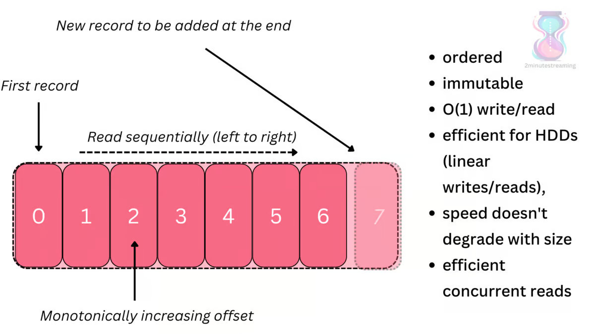

# Kafka

### What is Kafka?

Kafka is a distributed data streaming platform that can publish, subscribe to, store and process streams of records.

### What is the data structure used?

It’s a distributed commit log.

A log (a.k.a. {_write-ahead, commit, transaction} log_) is the simplest data structure.

<figure><figcaption></figcaption></figure>


### How is data stored in Kafka?

Data is stored in topics in Kafka

Kafka stores its data in topics. They’re split into partitions, and replicated across brokers.

```markdown
The structure is roughly:
* topics
    * partitions
        * replicas
            * a bunch of files (the log)
```

<figure><figcaption></figcaption></figure>

### Terminologies

* **Topic:** \
  Most fundamental unit of organization is the topic, which is something like a table in a relational database. <mark style="color:yellow;">A topic is a log of events</mark>. \
  Logs are easy to understand, because they are simple data structures with well-known semantics.
  * They are append only: When you write a new message into a log, it always goes on the end.
  * They can only be read by seeking an arbitrary offset in the log, then by scanning sequential log entries.&#x20;
  * Events in the log are immutable
* **Partition:**\
  <mark style="color:yellow;">Partitioning takes the single topic log and breaks it into multiple logs</mark>, each of which can live on a separate node in the Kafka cluster. \
  This way, the work of storing messages, writing new messages, and processing existing messages can be split among many nodes in the cluster.
* **Replicas:**\
  Replicas are Kafka nodes only which ensure high availability.
* **Replication Factor:**\
  <mark style="color:yellow;">The replication factor is the number of nodes to which your data is replicated</mark>
* **Kafka Log:**\
  Kafka log is a distributed commit log present inside a partition
* **Node:**
* **Kafka Cluster:**
* **Producers:**
* **Consumers**
